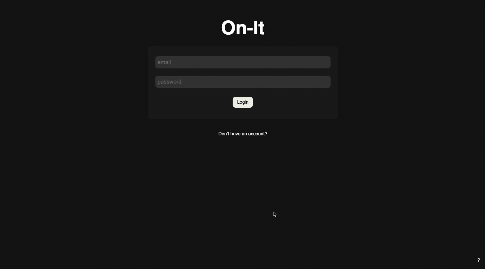
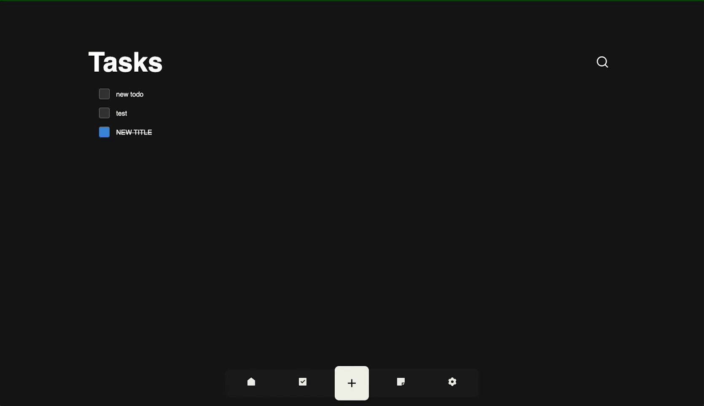
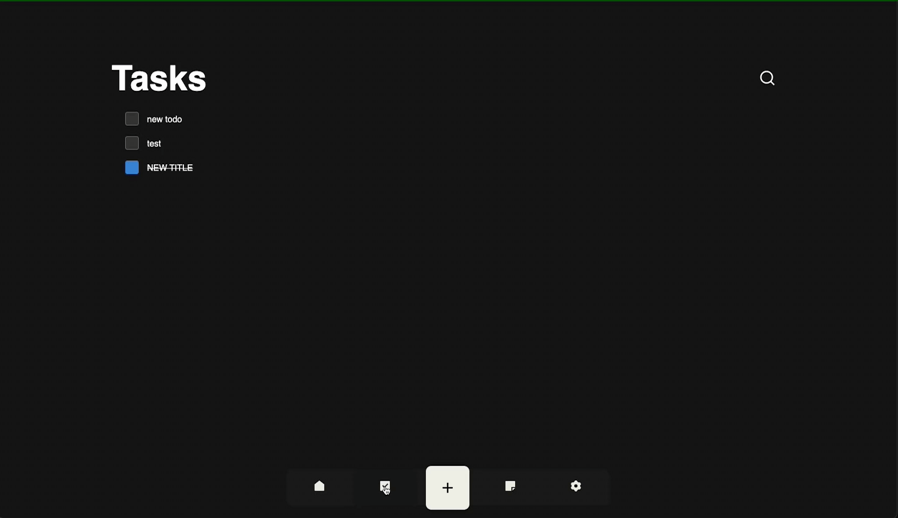
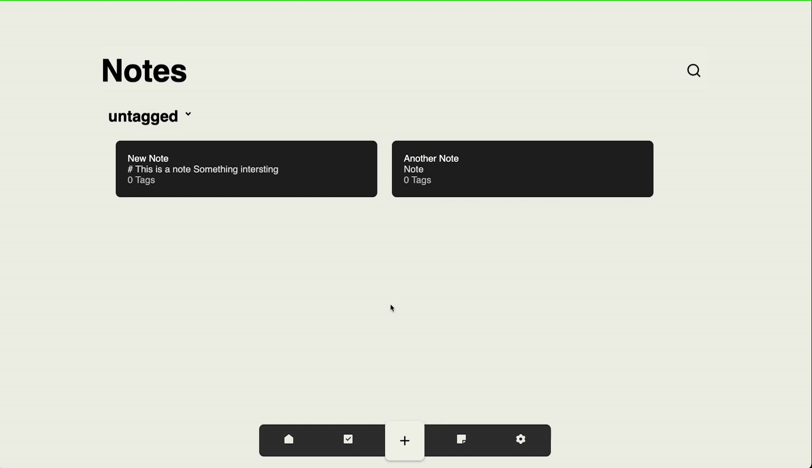
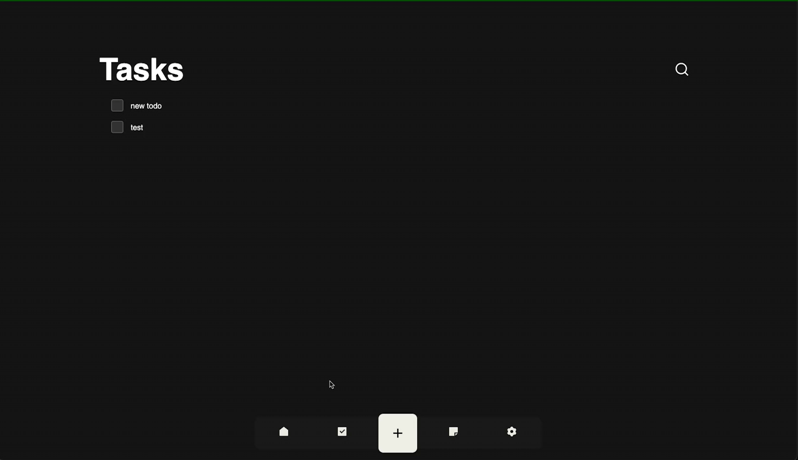
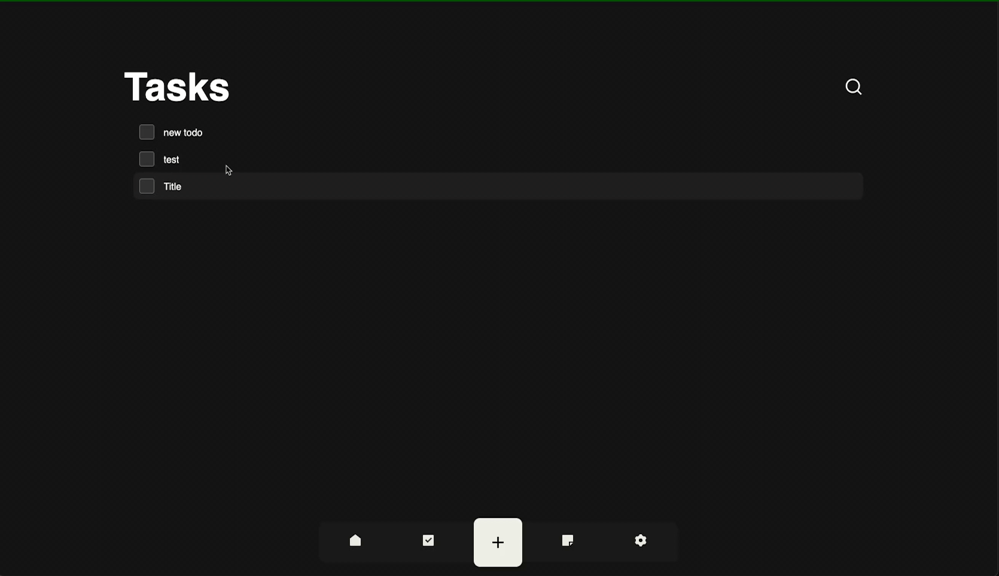

# On-It

Keeping you focused on what needs to get done
---

Ah, you've found us once again. We're taking a break from playing around with existences before we create an existential crisis. Being the powerful beings that we are among our lofty ideals and existential demands we tend to forget out more human task. You know homework, ideas, to do list, the things simple humans deal with. But, we still have to do them to some degree or else worlds begin falling apart.

Presenting On-It our solution to managing simpleton task. You can create projects with todos, notes, and ideas so your precious mind doesn't break down under pressure.

[Anomaly Detected] Ah duty calls, we must save the universe once again. You'll find other relevant information below and updates in the changelog. Godspeed.

---

Site: <https://jonoaugustine.gitlab.io/on-it>

Backend: <https://on-it-api.herokuapp.com/>

API Documentation: <https://app.swaggerhub.com/apis-docs/JonoAugustine/OnIt/2.0.0>

---

# Current State

- Production Build is having cookie issues with deployment server.
- Wrapping up tag implementation on frontend
- Changelog to be properly setup

More up to date progress can be found under repo issues.

## Features



### Dark/Light Mode



### Creating & Editing Notes




### Creating & Editing Tasks




---

## Usage

```bash
/on-it
$ yarn install
$ yarn build
$ yarn server <dev|start> # runs server in dev or prod mode
$ yarn site start # runs frontend
```

##
