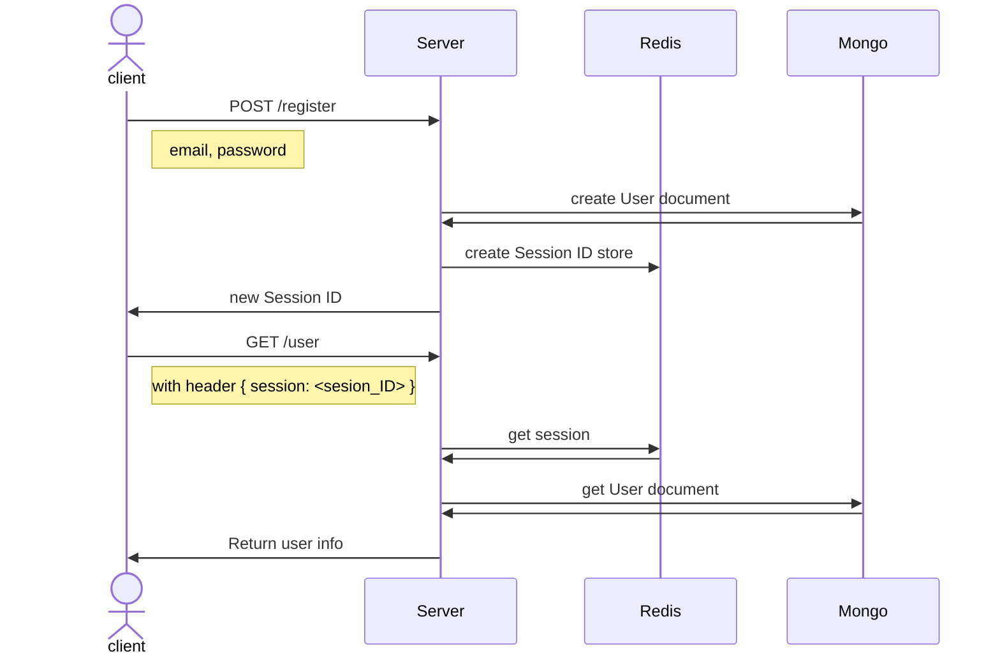

# On It - Server

This project contains the monolithic server/back-end for *On It*.
The deployed server itself as well as scripts for database
configuration.## Authentication

## Authentication

```mermaid
sequenceDiagram
    actor C as client
    participant S as Server
    participant R as Redis
    participant M as Mongo

    C->>S: POST /register
    Note right of C: email, password
    S->>M: create User document
    M->>S: 
    S->>R: create Session ID store
    S->>C: new Session ID
    C->>S: GET /user
    Note right of C: with header { session: <sesion_ID> }
    S->>R: get session
    R->>S: 
    S->>M: get User document
    M->>S: 
    S->>C: Return user info   
```
